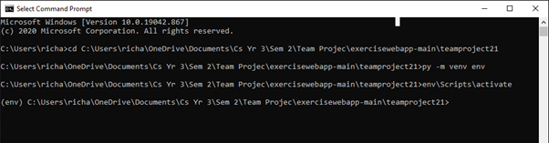

# Exercise Web App

Exercise web application using Flask for a university team project. This project will allow the users to upload exersises with video evidence to their friend group.
Other members of the same group will then be able to upvote or downvote if they feel the video evidence was satisfactory to what exersise they said they done.

## How to use 

To make use of the website full funstionality you must create 3 different user accounts. On one account create a group and take note of the group ID. For each account create a post and upload it making sure to use the same group ID. The post will then apear on the home page each account will have to upvote the other accounts posts. When a post gets upvotes equaling to the majority of members in the group it will then be uploaded to the leaderboard which you can see on the My Groups page. On this page you can see previous posts and a datachart comparing the accounts posts and their progress between each post.

## Installation guide

[Python Download](https://www.python.org/downloads/)

1. To begin with, install Python for your operating system using the link above.
2. Next, download our project file called “teamproject21”(ask Anthony where it will be )
3. Open the command prompt, this can be done by typing “cmd” in the search bar if you are on windows.
4. Save the project file to your desktop.
5.Locate the project file and open up teamproject21.
6. Click to the right of your file name until it is highlighted as shown below and copy it.

7.Type “cd” into your command prompt and then paste your file directory as shown below and press enter, the following line should appear if done correctly.

8. Now type “py -m venv env” and press enter as shown below.

9.You should now see a new folder in the teamproject21 directory named “env”.

10.Next, go back on to the cmd and type “env\Scripts\activate” and press enter. You should see (env) to the left of the file path as shown below.

11. Next type in “pip install flask” and wait for it to install, if you get a warning that a new version of pip is available go to step 12, if you don't get an update warning go to step 14.

12. Type “cd env\Scripts” and press enter, the cmd should now look like this.

13.next type “python.exe -m pip install --upgrade pip” and press enter, the newest version of pip should now be installed. The cmd will be as shown below.

14. Next you have to cd the original file directory so type “cd” then paste the file path for the teamproject21 like step 6. The cmd should now look like this again.

15. Next type “set FLASK_APP=run.py” and press enter as shown below.

16.Now type “flask run” and press enter, you will then be faced with an error that looks like this. This is normal.

17. You will now have to install some packages in order to get the local host server up. After every installation, type in “flask run” to bring up the next package to be installed. The commands include: (press enter after every command and let it install before typing “flask run”)
	1. ”pip install flask_sqlalchemy”
	2. ”pip install flask_bcrypt”
	3. ”pip install flask_login”
	4. ”pip install flask_wtf”
	5. ”pip install email_validator”
	6. ”pip install pandas” (this may take longer than the rest)
	7. ”pip install plotly”
  
18. After installing all the packages type “flask run” in the cmd. The server should now be up and running. To view the website copy and paste the http address into your browser as shown below and type home. E.g. "http://127.0.0.1:5000/home".

20. After viewing the website you will need to close the server by pressing CTRL+C.

## Authors 

* David Webber 
* Richard Taggart 
* Louis Totten
* Mark Tilbrook
* Zain Ali
